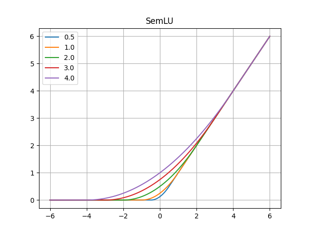
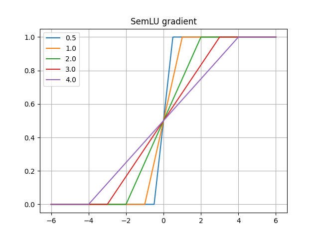

# Smooth ReLU in PyTorch


<br/>

Unofficial **PyTorch** reimplementation of the Smooth ReLU (SmeLU) activation function proposed in the
paper [Real World Large Scale Recommendation Systems Reproducibility and Smooth Activations](https://arxiv.org/pdf/2202.06499.pdf)
by Gil I. Shamir and Dong Lin.

**This repository includes an easy-to-use and pure PyTorch implementation of the Smooth ReLU.**

## Installation

The SmeLU can be installed by using `pip`.

````shell script
pip install git+https://github.com/ChristophReich1996/SmeLU
````

## Example Usage

The SmeLU can be simply used as a standard `nn.Module`:

````python
import torch
import torch.nn as nn
from smelu import SmeLU

network: nn.Module = nn.Sequential(
    nn.Linear(2, 2),
    SmeLU(),
    nn.Linear(2, 2)
)

output: torch.Tensor = network(torch.rand(16, 2))
````

For a more detailed examples on hwo to use this implementation please refer to the [example](example.py) file (requires
Matplotlib to be installed).

The SmeLU takes the following parameters.

| Parameter | Description | Type |
| ------------- | ------------- | ------------- |
| beta | Beta value if the SmeLU activation function. Default 2. | float |

## Reference

````bibtex
@article{Shamir2022,
        title={{Real World Large Scale Recommendation Systems Reproducibility and Smooth Activations}},
        author={Shamir, Gil I and Lin, Dong},
        journal={{arXiv preprint arXiv:2202.06499}},
        year={2022}
}
````
